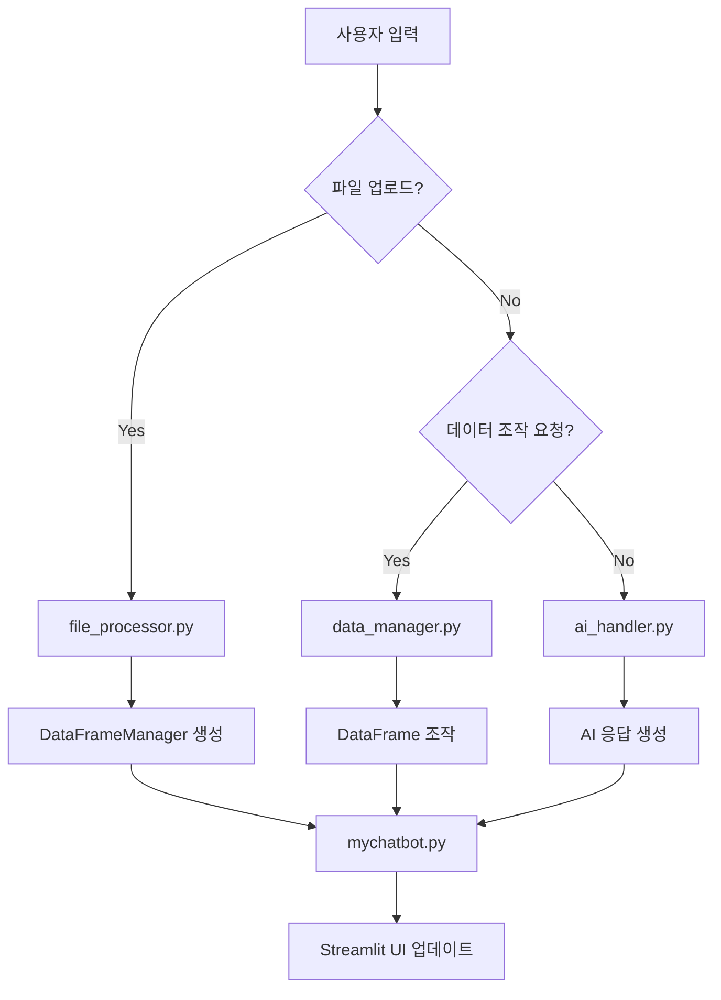

# 🏗️ MyChatbot 프로젝트 구조

## 📁 파일 구조

```
MyChatbot/
├── 📄 mychatbot.py          # 메인 Streamlit 앱 (UI만 담당)
├── 📄 data_manager.py       # 데이터프레임 조작 및 관리 클래스
├── 📄 file_processor.py     # 파일 업로드 및 처리 기능
├── 📄 ai_handler.py         # AI 모델 관리 및 응답 생성
├── 📄 requirements.txt      # 패키지 의존성
├── 📄 README.md            # 프로젝트 설명서
└── 📄 LICENSE              # 라이선스 정보
```

## 🎯 각 파일의 역할

### 📄 `mychatbot.py` - 메인 Streamlit 앱
**책임**: UI와 사용자 인터랙션만 담당
- Streamlit UI 구성 및 렌더링
- 사용자 입력 처리
- 세션 상태 관리
- 모듈 간 연결 및 조정

**주요 함수**:
- `main()`: 메인 Streamlit 앱 실행

### 📄 `data_manager.py` - 데이터 관리
**책임**: 데이터프레임 조작 및 관리
- DataFrame 조작 (필터링, 정렬, 삭제 등)
- 원본 데이터 보존
- 작업 히스토리 관리
- 데이터 내보내기 (CSV, Excel)

**주요 클래스**:
- `DataFrameManager`: 데이터프레임 조작을 위한 메인 클래스

**주요 함수**:
- `process_data_request()`: 사용자 요청을 데이터 조작으로 변환

### 📄 `file_processor.py` - 파일 처리
**책임**: 파일 업로드 및 처리
- CSV/XLSX 파일 읽기 및 분석
- 이미지 파일 처리
- DataFrame 생성 및 초기 분석

**주요 함수**:
- `process_uploaded_file()`: 업로드된 파일을 처리하고 DataFrame 생성
- `encode_image()`: 이미지 파일 인코딩

### 📄 `ai_handler.py` - AI 처리
**책임**: AI 모델 관리 및 응답 생성
- OpenAI API 통신
- 모델 템플릿 관리
- 컨텍스트 구성 및 응답 생성

**주요 클래스**:
- `AIHandler`: AI 응답 처리를 위한 메인 클래스

**주요 함수**:
- `get_model_templates()`: 지원되는 AI 모델 목록 반환

## 🔄 데이터 흐름



## 💬 지원되는 데이터 조작 명령어

### 🔍 데이터 조회
- `상위 10개 데이터 보여줘` 또는 `top 5`
- `하위 10개 데이터 보여줘` 또는 `bottom 3`

### 🎯 데이터 필터링
- `[컬럼명]에서 [키워드] 포함된 데이터만`
- `job_title에서 AI 관련 데이터만`
- `salary에서 100000 이상`

### 🗑️ 데이터 삭제
- `[컬럼명] 컬럼 삭제해줘`
- `불필요한 컬럼 제거`
- `3번째 행 삭제`

### 📈 데이터 정렬
- `[컬럼명] 기준으로 정렬해줘`
- `salary 내림차순으로 정렬`
- `이름 오름차순 정렬`

### 🔄 데이터 복원
- `원본 데이터로 복원`
- `초기화`

## 🚀 실행 방법

```bash
# 의존성 설치
pip install -r requirements.txt

# 환경변수 설정 (.env 파일)
OPENAI_APIKEY=your_api_key_here

# 앱 실행
streamlit run mychatbot.py
```

## 🔧 확장 가능성

### 새로운 데이터 조작 기능 추가
`data_manager.py`의 `DataFrameManager` 클래스에 메서드 추가 후, `process_data_request()` 함수에서 패턴 매칭 추가

### 새로운 파일 형식 지원
`file_processor.py`의 `process_uploaded_file()` 함수에 새로운 파일 타입 처리 로직 추가

### 새로운 AI 모델 지원
`ai_handler.py`의 `get_model_templates()` 함수에 새로운 모델 정보 추가

## 📦 의존성

- `streamlit>=1.28.0` - 웹 UI 프레임워크
- `openai>=1.3.0` - OpenAI API 클라이언트
- `pandas>=2.0.0` - 데이터 조작 라이브러리
- `openpyxl>=3.1.0` - Excel 파일 지원
- `python-dotenv>=1.0.0` - 환경변수 관리
- `pillow>=10.0.0` - 이미지 처리

## 📋 특징

✅ **모듈화된 구조**: 각 기능이 별도 파일로 분리되어 유지보수 용이  
✅ **확장 가능한 설계**: 새로운 기능 추가가 간단함  
✅ **타입 힌팅**: 코드 안정성과 IDE 지원 향상  
✅ **에러 처리**: 각 모듈에서 적절한 예외 처리  
✅ **원본 데이터 보존**: 모든 조작은 원본을 유지하며 새로운 결과 생성  

이 구조를 통해 코드의 가독성, 유지보수성, 확장성이 크게 향상되었습니다! 🎉 